# PostgreSQL Data Model

Status: initial MVP architecture proposal. This document defines the target model and migration sequence; it does not authorize schema generation outside Flyway.

## 1. Scope and Assumptions

- Database: PostgreSQL 17.
- Scope: documented MVP requirements only; no public registration, comments, payments, Telegram publishing, advanced analytics, or multi-tenancy.
- Spring/Hibernate must use schema validation only. Flyway exclusively owns schema changes.
- The model supports Persian (`fa`, RTL) and English (`en`, LTR), while technical identifiers remain direction-independent.
- Administrative users are in MVP. Public registered users and editor workflows are future concerns.
- All table, column, constraint, and index names use `snake_case`.
- No database credentials, password values, or production secrets belong in schema documentation or migrations.

## 2. Data-Model Goals

- Preserve relational integrity with explicit foreign keys, unique constraints, check constraints, and deterministic ordering.
- Model bilingual public content explicitly without EAV or a generic content/translation table.
- Keep publishable lifecycle, SEO, media, and audit behavior consistent while preserving domain boundaries.
- Support PostgreSQL full-text search for the documented blog search requirement.
- Keep the first migration small, reviewable, and independent from unfinished business modules.

## 3. MVP Domain Boundaries

| Candidate | Decision | Reason |
|---|---|---|
| Administrative users | **MVP required** | Admin login, authorization, ownership, and audit actors require persisted identities. |
| Roles | **MVP required** | Admin and site-owner authorization require persisted role assignments. |
| Permission catalog/tables | **Deferred** | MVP permissions can be mapped in code from stable roles; tables are justified only if editor/custom-role requirements become concrete. |
| Blog posts | **MVP required** | Blog CRUD, publishing, pagination, filtering, attachments, and search are Must requirements. |
| Portfolio projects | **MVP required** | Portfolio list and category/tab presentation are Must requirements. |
| Publications | **MVP required** | Academic publication presentation and visible publication stage are Must requirements. |
| Resume/experience entries | **MVP required** | Structured, editable resume sections and replaceable CV media are Must requirements. |
| Skills | **MVP required** | Skill CRUD and categorization are Must requirements. |
| Separate technologies table | **Rejected** | Technologies use the skill domain and project-skill join; a parallel taxonomy would duplicate concepts. |
| Tags | **MVP required** | Blog tag filtering is a Must requirement. |
| Media assets | **MVP required** | Secure uploads, CV replacement, post attachments, and public media require persisted metadata. |
| Localized Persian/English content | **MVP required** | Public content, slugs, SEO fields, and missing-translation behavior are bilingual from launch. |
| Standalone SEO metadata table | **Rejected** | SEO fields belong to each localized public record; a generic SEO table would weaken constraints and ownership. |
| Audit information | **MVP required** | Sensitive authentication, content, media, and settings actions must be auditable. |

Additional documented MVP domains included despite not being candidate-list items: managed pages, blog categories, contact messages, social links, and featured content.

## 4. Entity Inventory

| Domain | Proposed tables |
|---|---|
| Identity/RBAC | `app_user`, `role`, `user_role` |
| Audit | `audit_event` |
| Pages/contact | `content_page`, `content_page_translation`, `featured_item`, `social_link`, `contact_message` |
| Media | `media_asset`, `media_asset_translation` |
| Blog | `blog_category`, `blog_category_translation`, `blog_post`, `blog_post_translation`, `tag`, `tag_translation`, `blog_post_tag`, `blog_post_media` |
| Portfolio | `portfolio_project`, `portfolio_project_translation`, `portfolio_project_skill` |
| Publications | `publication`, `publication_translation` |
| Resume | `resume_entry`, `resume_entry_translation`, `resume_document` |
| Skills | `skill_category`, `skill_category_translation`, `skill`, `skill_translation` |

## 5. Entity Responsibilities

Common notation below: `id` is UUID unless a composite primary key is stated. Mutable aggregate and translation tables include `created_at`, `updated_at`, nullable `created_by`, nullable `updated_by`, nullable `deleted_at`, nullable `deleted_by`, and `version`. Translation rows additionally use `language_code` with `CHECK (language_code IN ('fa','en'))`.

### Identity and audit

| Table | Purpose and important columns | Keys and constraints | Indexes | Lifecycle and localization |
|---|---|---|---|---|
| `app_user` | Administrative identity: `email`, `password_hash`, `display_name`, `enabled`, `failed_login_count`, `locked_until`, `last_login_at`, audit columns, `version`. | PK `id`; self-FKs for audit users are nullable; unique index on `lower(email)`; checks for trimmed/non-empty email and nonnegative failure count. | `lower(email)`, `enabled`, `locked_until`. | Mutable, soft-deletable; disabled users cannot authenticate. Display name is admin-facing and not localized. |
| `role` | Stable authorization role: `code`, `description`, `is_active`, audit columns, `version`. | PK `id`; unique `code`; check code is uppercase stable identifier. | `code`, `is_active`. | Reference data; deactivate rather than delete. Not localized in MVP. |
| `user_role` | Many-to-many role assignment: `user_id`, `role_id`, `assigned_at`, `assigned_by`. | Composite PK (`user_id`,`role_id`); FKs to `app_user` and `role`; assignment actor nullable. | Reverse index on (`role_id`,`user_id`). | Hard-delete assignment when revoked; no localization. |
| `audit_event` | Append-only event: `occurred_at`, `actor_user_id`, `action`, `target_type`, `target_id`, `request_id`, `ip_address`, `outcome`, sanitized `details`. | PK `id`; actor FK uses `ON DELETE SET NULL`; target is intentionally non-FK because events span modules; checks on action/outcome; `details` may be JSONB only for sanitized sparse audit context. | (`occurred_at` DESC), (`actor_user_id`,`occurred_at` DESC), (`target_type`,`target_id`,`occurred_at` DESC), `request_id`. | Append-only; no soft delete or updates. Never localize event facts; presentation may translate action labels. |

### Pages, contact, and media

| Table | Purpose and important columns | Keys and constraints | Indexes | Lifecycle and localization |
|---|---|---|---|---|
| `content_page` | Managed page aggregate: `page_key`, `status`, `published_at`, audit columns, `version`. Covers landing, about, research, resume intro, and contact copy. | PK `id`; unique `page_key`; status check. | (`status`,`published_at`), `updated_at`. | `DRAFT -> PUBLISHED -> ARCHIVED`; soft delete. Text exists only in translations. |
| `content_page_translation` | Localized page: `content_page_id`, `language_code`, `title`, `slug`, `summary`, `body_markdown`, `seo_title`, `seo_description`, `canonical_path`, `og_media_id`, audit columns, `version`. | PK `id`; FKs to page and optional media; unique (`content_page_id`,`language_code`); partial unique index on (`language_code`, `lower(slug)`) where not deleted; nonblank title/slug checks. | Slug lookup, (`content_page_id`,`language_code`), optional search GIN after need is proven. | Soft delete; one row per available locale. Missing locale is explicit, never silently substituted. |
| `featured_item` | Ordered manual landing feature: `slot_key`, optional `blog_post_id`, `portfolio_project_id`, or `publication_id`, `sort_order`, `starts_at`, `ends_at`, `is_active`, audit columns, `version`. | PK `id`; explicit nullable FKs; check exactly one target FK is non-null; unique (`slot_key`,`sort_order`) among active rows; time-range check. | (`slot_key`,`is_active`,`sort_order`), active time window. | Operational lifecycle via `is_active` and time window; target supplies localization. |
| `social_link` | Admin-managed professional link: `platform_code`, `url`, `sort_order`, `is_active`, audit columns, `version`. | PK `id`; unique `platform_code`; URL nonblank/check against allowed schemes; nonnegative order. | (`is_active`,`sort_order`). | Deactivate instead of delete; platform labels come from UI i18n, URL remains direction-independent. |
| `contact_message` | Submitted contact data: `sender_name`, `sender_email`, `message`, `source_language`, `status`, `submitted_at`, `read_at`, `archived_at`. | PK `id`; language/status checks; nonblank and bounded-length checks; no user FK. | (`status`,`submitted_at` DESC), `sender_email`, `submitted_at`. | `NEW -> READ -> ARCHIVED`; retention-based hard purge, not soft delete. User-entered text retains submitted language/direction. |
| `media_asset` | Secure file metadata: `storage_key`, `original_filename`, `extension`, `mime_type`, `size_bytes`, `checksum_sha256`, `width`, `height`, `status`, audit columns, `version`. | PK `id`; unique `storage_key`; optional unique checksum policy remains open; checks for positive size/dimensions and allowed status. | `storage_key`, `checksum_sha256`, (`status`,`created_at` DESC), `created_by`. | `ACTIVE -> ARCHIVED`; soft delete only after reference checks. Binary storage is outside PostgreSQL. |
| `media_asset_translation` | Localized `alt_text` and `caption` for a media asset. | PK `id`; FK to media; unique (`media_asset_id`,`language_code`); alt length checks. | (`media_asset_id`,`language_code`). | Soft delete; missing alt translation must be surfaced in admin. Decorative usage is represented by an explicit empty alt value at presentation time, not inferred from missing data. |

### Blog and taxonomy

| Table | Purpose and important columns | Keys and constraints | Indexes | Lifecycle and localization |
|---|---|---|---|---|
| `blog_category` | Stable blog category: `category_key`, `sort_order`, `is_active`, audit columns, `version`. | PK `id`; unique key; nonnegative order. | (`is_active`,`sort_order`). | Deactivate rather than delete; labels/slugs are translated. |
| `blog_category_translation` | Localized category: `blog_category_id`, `language_code`, `name`, `slug`, `seo_title`, `seo_description`, audit columns, `version`. | PK `id`; FK category; unique parent+locale; partial unique (`language_code`,`lower(slug)`) for active rows; nonblank checks. | Slug lookup and parent+locale. | Soft delete; no silent fallback. |
| `blog_post` | Post aggregate: `author_user_id`, `category_id`, `cover_media_id`, `status`, `published_at`, `scheduled_for`, audit columns, `version`. | PK `id`; explicit FKs; status and scheduling checks. | (`status`,`published_at` DESC,`id` DESC), category/status/published, author. | `DRAFT -> PUBLISHED -> ARCHIVED`; preview is not a persisted status; soft delete. |
| `blog_post_translation` | Localized post: `blog_post_id`, `language_code`, `title`, `slug`, `excerpt`, `body_markdown`, SEO fields, `search_vector`, audit columns, `version`. | PK `id`; FK post; unique parent+locale; partial unique locale+lower(slug); title/slug/body checks. | Slug lookup; GIN on `search_vector`; optional trigram index requires a separate decision. | Soft delete; only published parent+available locale is public. Persian uses `simple` FTS configuration initially; English uses `english`. |
| `tag` | Stable tag identity: `tag_key`, `is_active`, audit columns, `version`. | PK `id`; unique key. | `tag_key`, `is_active`. | Deactivate rather than delete; labels/slugs are translated. |
| `tag_translation` | Localized tag: `tag_id`, `language_code`, `name`, `slug`, SEO fields, audit columns, `version`. | PK `id`; FK tag; unique parent+locale; partial unique locale+lower(slug); nonblank checks. | Slug lookup and parent+locale. | Soft delete; no silent fallback. |
| `blog_post_tag` | Post/tag many-to-many mapping. | Composite PK (`blog_post_id`,`tag_id`); explicit FKs; duplicate prevention by PK. | Reverse (`tag_id`,`blog_post_id`). | Hard-delete mapping; no localization. |
| `blog_post_media` | Ordered post attachment/inline media: `blog_post_id`, `media_asset_id`, `usage`, `sort_order`. | Composite PK (`blog_post_id`,`media_asset_id`,`usage`); FKs; usage and nonnegative-order checks; unique post+usage+order. | (`blog_post_id`,`usage`,`sort_order`), media reverse lookup. | Hard-delete mapping; localized alt/caption comes from media translation. |

### Portfolio, publication, resume, and skills

| Table | Purpose and important columns | Keys and constraints | Indexes | Lifecycle and localization |
|---|---|---|---|---|
| `portfolio_project` | Project aggregate: `project_key`, `cover_media_id`, `status`, `started_on`, `ended_on`, `project_url`, `repository_url`, `sort_order`, audit columns, `version`. | PK `id`; unique key; explicit media FK; status/date/order checks. | (`status`,`sort_order`,`id`), date range. | `DRAFT -> PUBLISHED -> ARCHIVED`; soft delete. URLs are direction-independent. |
| `portfolio_project_translation` | Localized project: `portfolio_project_id`, `language_code`, `title`, `slug`, `summary`, `body_markdown`, SEO fields, audit columns, `version`. | PK `id`; FK project; unique parent+locale; partial unique locale+lower(slug); nonblank checks. | Slug lookup and parent+locale. | Soft delete; only available published locale is public. |
| `portfolio_project_skill` | Ordered project technology/skill mapping: `portfolio_project_id`, `skill_id`, `sort_order`. | Composite PK (`portfolio_project_id`,`skill_id`); explicit FKs; unique project+order; nonnegative order. | Reverse skill lookup. | Hard-delete mapping; skill translation provides localized label. |
| `publication` | Publication aggregate: `publication_key`, `content_status`, `publication_stage`, `doi`, `external_url`, `published_on`, `year`, `cover_media_id`, `sort_order`, audit columns, `version`. | PK `id`; unique key; partial unique `lower(doi)` when DOI exists; media FK; content-status, stage, year/date, DOI-format, and order checks. | (`content_status`,`year` DESC,`sort_order`), DOI lookup, stage. | CMS lifecycle is separate from academic stage (`PREPRINT`, `ACCEPTED`, `IN_PRESS`, `PUBLISHED`); soft delete. DOI/URL are direction-independent. |
| `publication_translation` | Localized publication display: `publication_id`, `language_code`, `title`, `slug`, `abstract_text`, `authors_display`, `venue_display`, SEO fields, audit columns, `version`. | PK `id`; FK publication; unique parent+locale; partial unique locale+lower(slug); nonblank checks. | Slug lookup and parent+locale; optional search index deferred. | Soft delete; author/venue display may differ by script, while DOI remains shared. |
| `resume_entry` | Ordered resume item: `entry_type`, `status`, `started_on`, `ended_on`, `is_current`, `sort_order`, audit columns, `version`. | PK `id`; type/status/date/current/order checks. | (`entry_type`,`status`,`sort_order`,`id`), date range. | `DRAFT -> PUBLISHED -> ARCHIVED`; soft delete. Text is translated. |
| `resume_entry_translation` | Localized resume text: `resume_entry_id`, `language_code`, `title`, `organization`, `location`, `summary`, audit columns, `version`. | PK `id`; FK entry; unique parent+locale; nonblank title/organization checks. | Parent+locale. | Soft delete; no slug because entries have no independent public detail route in MVP. |
| `resume_document` | Replaceable language-specific CV: `language_code`, `media_asset_id`, `status`, `published_at`, audit columns, `version`. | PK `id`; media FK; partial unique locale for current nondeleted row; status check. | (`language_code`,`status`). | `DRAFT -> PUBLISHED -> ARCHIVED`; soft delete; media metadata/alt text uses the same locale. |
| `skill_category` | Ordered skill grouping: `category_key`, `sort_order`, `is_active`, audit columns, `version`. | PK `id`; unique key; nonnegative order. | (`is_active`,`sort_order`). | Deactivate rather than delete; labels are translated. |
| `skill_category_translation` | Localized category: `skill_category_id`, `language_code`, `name`, `description`, audit columns, `version`. | PK `id`; FK category; unique parent+locale; nonblank name. | Parent+locale. | Soft delete; no silent fallback. |
| `skill` | Stable skill/technology: `skill_key`, `skill_category_id`, `sort_order`, `is_active`, audit columns, `version`. | PK `id`; category FK; unique key; nonnegative order. | (`skill_category_id`,`is_active`,`sort_order`). | Deactivate rather than delete; no subjective proficiency field until requirements define one. |
| `skill_translation` | Localized skill: `skill_id`, `language_code`, `name`, `description`, audit columns, `version`. | PK `id`; FK skill; unique parent+locale; nonblank name. | Parent+locale and optional lower(name) lookup. | Soft delete; technical product names may be identical across locales without being silently copied. |

## 6. Relationships and Cardinalities

```mermaid
erDiagram
    APP_USER ||--o{ USER_ROLE : has
    ROLE ||--o{ USER_ROLE : assigned
    APP_USER ||--o{ AUDIT_EVENT : acts
    APP_USER ||--o{ BLOG_POST : authors

    CONTENT_PAGE ||--o{ CONTENT_PAGE_TRANSLATION : translates
    MEDIA_ASSET ||--o{ MEDIA_ASSET_TRANSLATION : translates
    MEDIA_ASSET ||--o{ CONTENT_PAGE_TRANSLATION : og_media

    BLOG_CATEGORY ||--o{ BLOG_CATEGORY_TRANSLATION : translates
    BLOG_CATEGORY ||--o{ BLOG_POST : categorizes
    BLOG_POST ||--o{ BLOG_POST_TRANSLATION : translates
    BLOG_POST ||--o{ BLOG_POST_TAG : tagged
    TAG ||--o{ TAG_TRANSLATION : translates
    TAG ||--o{ BLOG_POST_TAG : classifies
    BLOG_POST ||--o{ BLOG_POST_MEDIA : attaches
    MEDIA_ASSET ||--o{ BLOG_POST_MEDIA : reused

    PORTFOLIO_PROJECT ||--o{ PORTFOLIO_PROJECT_TRANSLATION : translates
    PORTFOLIO_PROJECT ||--o{ PORTFOLIO_PROJECT_SKILL : uses
    SKILL ||--o{ PORTFOLIO_PROJECT_SKILL : applied
    MEDIA_ASSET ||--o{ PORTFOLIO_PROJECT : covers

    PUBLICATION ||--o{ PUBLICATION_TRANSLATION : translates
    MEDIA_ASSET ||--o{ PUBLICATION : covers
    RESUME_ENTRY ||--o{ RESUME_ENTRY_TRANSLATION : translates
    MEDIA_ASSET ||--o{ RESUME_DOCUMENT : provides
    SKILL_CATEGORY ||--o{ SKILL_CATEGORY_TRANSLATION : translates
    SKILL_CATEGORY ||--o{ SKILL : groups
    SKILL ||--o{ SKILL_TRANSLATION : translates

    BLOG_POST o|--o{ FEATURED_ITEM : features
    PORTFOLIO_PROJECT o|--o{ FEATURED_ITEM : features
    PUBLICATION o|--o{ FEATURED_ITEM : features
```

All translation relationships are one aggregate to zero, one, or two locale rows. Public APIs expose only the requested locale row when the parent is published.

## 7. Localization Strategy

### Approach A: translation table per domain entity

- Explicit tables such as `blog_post_translation` and `publication_translation`.
- Strong foreign keys, required-field checks, domain-specific SEO fields, and clear JPA ownership.
- More tables and migrations, but failures remain local to a bounded context.

### Approach B: shared generic translation/content table

- One table with `entity_type`, `entity_id`, locale, generic title/body fields, and optional JSONB.
- Fewer table names, but no target foreign key, weak domain constraints, polymorphic joins, and EAV-like growth.
- Harder query plans, repository code, Flyway evolution, and deletion integrity.

**MVP decision: Approach A.** It follows project rules, preserves normalized domain data, avoids a generic entity model, and allows locale-specific constraints and search indexes.

## 8. Persian and English Content Behavior

- Supported language codes are exactly `fa` and `en`.
- A missing translation returns an explicit unavailable state and link to the available locale; it never returns the other language as if translated.
- Persian/English direction is presentation metadata, not duplicated database state.
- Technical identifiers, code, URLs, storage keys, hashes, and DOI values are shared direction-independent values.
- Persian text normalization may map Arabic `ي/ك` to Persian `ی/ک` for search input, but stored authored content is preserved unless an explicit editorial normalization rule is approved.

## 9. Primary-Key Strategy

- Aggregate, translation, operational, and audit tables use UUID primary keys.
- Pure many-to-many/junction tables use composite primary keys of their foreign keys; ordered junctions add a unique parent+order constraint.
- Business keys (`page_key`, `publication_key`, `skill_key`) are alternate unique identifiers, never primary keys.

## 10. UUID Generation Strategy

- Use application-generated RFC 4122 UUIDv4 with the Java standard library, before persistence.
- Do not depend on UUID ordering. Every ordered query uses an explicit timestamp/order column plus `id` as a deterministic tie-breaker.
- Database-generated UUID defaults may be reconsidered only if bulk ingestion outside the application becomes a real requirement.

## 11. Timestamp and Timezone Strategy

- All instants use PostgreSQL `timestamptz` and are interpreted/stored as UTC.
- Calendar-only facts such as publication dates and employment start/end dates use `date`.
- `created_at`, `updated_at`, `published_at`, schedule times, lock times, and audit occurrence times use `timestamptz`.
- The application supplies a UTC clock; clients localize display. Database defaults may use `CURRENT_TIMESTAMP` for insertion safety.

## 12. Audit-Column Strategy

- Mutable aggregates and translations use `created_at`, `updated_at`, `created_by`, `updated_by`, `deleted_at`, `deleted_by`, and `version`.
- Reference records add `is_active` when activation is distinct from deletion.
- Join tables keep only assignment metadata where needed; immutable audit events do not use mutable audit columns.

## 13. Created-By and Updated-By Strategy

- Actor columns are nullable FKs to `app_user` with `ON DELETE SET NULL` so audit history survives user removal.
- Bootstrap/system operations may leave actor IDs null and must emit an explicit system actor in `audit_event` details.
- Never derive ownership from the current user at read time; store the actor at mutation time.

## 14. Soft-Delete Decision

- Admin-managed content, translations, users, and media use `deleted_at`/`deleted_by`.
- Public queries always require `deleted_at IS NULL` and the appropriate published/active state.
- Junction rows are hard-deleted when associations are removed.
- Audit events are retained append-only. Contact messages are hard-purged under a future retention policy.
- Partial unique indexes exclude soft-deleted rows where reuse of a slug/key is allowed.

## 15. Status and Lifecycle Modeling

- Persisted publishable lifecycle: `DRAFT`, `PUBLISHED`, `ARCHIVED` using `varchar` plus check constraints.
- Preview is a read mode over draft data, not a database status.
- `REJECTED`/`NEEDS_EDIT` are deferred until a multi-editor review workflow is approved.
- Publication academic stage is separate from CMS lifecycle.
- Use explicit transition validation in the service layer and database value checks for allowed states.

## 16. Slug Strategy

- Slugs live on translation rows and are language-specific.
- Backend normalization trims whitespace, uses hyphens, rejects `/`, `?`, `#`, control characters, leading/trailing hyphens, and empty values.
- Unicode Persian slugs are allowed. English slugs should be lowercase ASCII where practical.
- Slugs are immutable after publication by default; redirects for changed slugs are deferred until requirements exist.

## 17. Slug Uniqueness Rules per Locale

- Unique namespace is per domain route and locale, for example posts use unique (`language_code`, `lower(slug)`) among nondeleted rows.
- Page, post, portfolio, publication, category, and tag slugs have separate namespaces because their route prefixes differ.
- Partial unique indexes, not application checks alone, enforce uniqueness with soft deletion.

## 18. Tagging Strategy

- Blog tags use stable `tag` identities, localized `tag_translation` labels/slugs, and `blog_post_tag` mappings.
- Categories remain separate and a post has one category in MVP; tags are many-to-many.
- Do not reuse blog tags as portfolio technologies. Portfolio technologies reference `skill`.

## 19. Media Ownership and Reuse Strategy

- `media_asset` owns storage metadata; binary files remain in the configured media volume/object store.
- Reuse is explicit through domain FKs and junction tables, never polymorphic `owner_type/owner_id` columns.
- Deleting/archiving media is blocked while active domain references exist.
- `blog_post_media` supports ordered attachments; cover/OG/CV references use explicit FKs.
- Alt text and captions are localized in `media_asset_translation`.

## 20. SEO Metadata Strategy

- `seo_title`, `seo_description`, canonical path, and optional OG media belong to localized public records.
- No generic SEO table is proposed for MVP.
- Publish validation requires language-specific SEO fields where project SEO rules require them.
- Structured-data values are assembled from normalized domain fields; JSON-LD is not stored as arbitrary JSONB.

## 21. User, Role, and Permission Strategy

- MVP persists administrative users, roles, and assignments.
- Initial role codes: `ADMIN` and `SUPER_ADMIN`; no credentials are seeded in migrations.
- Authorization maps stable role codes to code-defined permissions. A permission catalog and `role_permission` table are deferred until custom roles/editors are approved.
- Public registration and registered-user profiles are outside MVP.

## 22. Password-Storage Requirements

- Store only an adaptive one-way hash in `password_hash`, including algorithm identifier and parameters as produced by Spring Security.
- Prefer Argon2id where deployment resources permit; BCrypt is an acceptable reviewed fallback.
- Plaintext, reversible encryption, unsalted digests, password hints, and password logging are prohibited.
- Password reset tokens, if added, store only token hashes with expiry and one-time-use state in a separate future table.

## 23. Table Naming Conventions

- Singular `snake_case`: `blog_post`, not `blog_posts`.
- Translation table suffix `_translation`; junction names combine both domains, such as `blog_post_tag`.
- Avoid reserved words (`app_user`, not `user`).
- Constraint prefixes: `pk_`, `fk_`, `uq_`, `ck_`; indexes use `ix_` and unique indexes `ux_`.

## 24. Column Naming Conventions

- Primary key `id`; foreign key `<referenced_entity>_id`.
- Instants end `_at`; dates end `_on`; booleans begin `is_`/`has_`; deterministic positions use `sort_order`.
- Stable machine keys end `_key`; display text belongs to translation rows.
- Do not encode direction in technical columns or duplicate fields with `_rtl`/`_ltr` suffixes.

## 25. PostgreSQL Data Types

| Data | Type |
|---|---|
| IDs/FKs | `uuid` |
| Instants | `timestamptz` |
| Calendar dates | `date` |
| Short bounded identifiers | `varchar(n)` |
| Markdown, summaries, messages | `text` |
| Locale | `varchar(2)` with check |
| Sizes/order/version | `bigint` or `integer` as appropriate |
| IP address | `inet` |
| Search document | `tsvector` |
| Flexible audit details only | `jsonb` with strict sanitization/size limits |

Use checked `varchar` values rather than PostgreSQL enum types so Flyway can evolve allowed states transactionally. JSONB is not used for normal relational content.

## 26. Foreign-Key Rules

- Every relational reference has an explicitly named FK.
- FKs are indexed on high-cardinality/query paths and on the reverse side of junctions.
- Nullable references are used only when absence has a defined meaning.
- Audit target IDs are the sole intentional non-FK polymorphic reference; this exception preserves cross-module audit history.

## 27. Delete and Update Actions

- Parent-to-translation and parent-to-junction physical deletion: `ON DELETE CASCADE`, invoked only by controlled purge operations.
- Content-to-media, role assignments, categories, authors, and skill references: `ON DELETE RESTRICT` unless explicitly nullable.
- Actor references in audit columns/events: `ON DELETE SET NULL`.
- Business identifiers and PKs never cascade on update; use default `ON UPDATE NO ACTION`.

## 28. Unique Constraints

- Case-insensitive administrative email via unique index on `lower(email)` for nondeleted users.
- Stable keys unique within each table.
- One translation per parent and language.
- Locale-specific slugs unique per domain among nondeleted rows.
- Junction composite keys prevent duplicates.
- DOI unique case-insensitively when present.
- Active resume document unique per locale according to the final replacement policy.

## 29. Check Constraints

- Allowed locale, status, role-code, usage, entry-type, publication-stage, and contact-status values.
- Nonblank trimmed names, titles, keys, and slugs.
- `sort_order >= 0`, file sizes positive, dimensions nonnegative, failure counts nonnegative.
- End dates/times are not before start dates/times.
- Exactly one `featured_item` target is set.
- `published_at` is required when status is `PUBLISHED`; archived content cannot have a future publish time.

## 30. Index Strategy

- Add indexes only for documented access paths; validate with query plans before adding duplicates.
- Public content: status + published date/order + UUID tie-breaker.
- Admin lists: updated time DESC + UUID.
- Translation lookup: parent+locale and locale+slug.
- Taxonomy filters: category/tag reverse indexes.
- Audit: actor/time, target/time, request ID.
- GIN only on blog translation `search_vector` in MVP.

## 31. Search Requirements

- MVP blog search covers localized title, excerpt, and body.
- Store/maintain a `tsvector` per `blog_post_translation` with a GIN index.
- English uses PostgreSQL `english`; Persian initially uses `simple` plus application-side query normalization.
- Search always filters parent status, soft deletion, and requested locale before ranking.
- Trigram/fuzzy search and search across portfolio/publications are deferred until measured need.

## 32. Pagination and Ordering Requirements

- Public blog: keyset order by `published_at DESC, id DESC`.
- Admin lists: `updated_at DESC, id DESC`, with validated bounded page size.
- Ordered content: `sort_order ASC, id ASC`.
- Publications: `year DESC, sort_order ASC, id ASC`.
- Resume: explicit `sort_order ASC, started_on DESC, id ASC`; never rely on UUID or insertion order.

## 33. Data-Integrity Invariants

- Public content is nondeleted, parent `PUBLISHED`, and has the requested translation.
- Every translation belongs to exactly one valid parent and locale pair.
- Published rows have a publish timestamp and required localized SEO data.
- Media cannot be purged while referenced.
- Soft-deleted or inactive taxonomy is not assignable to new content.
- A featured slot references exactly one published target when publicly visible.
- Optimistic `version` must match on every admin update; conflicts return an explicit concurrent-modification response.

## 34. Security and Privacy Considerations

- Minimize contact-message PII and define retention before launch; do not store raw IP addresses unless abuse controls require and justify them.
- Never write password hashes, tokens, contact bodies, secrets, or uploaded file contents into audit details/logs.
- Sanitize rendered Markdown/Rich Text; database storage alone does not prevent XSS.
- Validate file extension, MIME type, size, storage key, and checksum before persisting active media.
- Authorization is enforced by backend services; database role rows do not replace endpoint checks.

## 35. Migration Sequencing Proposal

1. `V1`: identity roles/assignments and append-only audit foundation.
2. `V2`: media asset metadata and media translations.
3. `V3`: managed pages, translations, social links, and contact messages.
4. `V4`: blog categories, posts, tags, attachments, and localized search vector.
5. `V5`: skill taxonomy, portfolio projects, translations, and project-skill links.
6. `V6`: publications, resume entries, and resume documents.
7. `V7`: featured content plus reviewed secondary/search indexes after query behavior is known.

Each migration is forward-only, transactional where PostgreSQL permits, and paired with integration tests before merge.

## 36. Proposed Flyway V1 Scope

Proposed name: `V1__create_identity_and_audit_foundation.sql` (proposal only; no file is created by this task).

V1 contains only:

- `app_user`
- `role`
- `user_role`
- `audit_event`
- Required PK/FK/unique/check constraints and essential indexes
- Stable `ADMIN` and `SUPER_ADMIN` role rows, but **no user, password, token, or credential seed**

This scope is small enough to review independently and does not force unfinished content entities into the first migration.

## 37. Deferred Tables and Features

- `permission` and `role_permission` until custom roles/editors are approved.
- Public-user profiles, registration, verification, password reset/session/token tables until authentication design selects a mechanism.
- Content revision/history and editorial review tables.
- Comments, reactions, payments, Telegram drafts, analytics events, menu/theme/layout/slider configuration.
- Generic redirects/slug history, advanced search dictionaries, trigram indexes, publication author normalization, and S3-specific metadata.
- A separate technologies taxonomy; skills serve that purpose.

## 38. Open Decisions

1. Authentication mechanism (server session versus token) and its future session/token tables.
2. Argon2id resource parameters versus BCrypt fallback.
3. Contact-message retention period and whether abuse prevention justifies an IP hash.
4. Exact CV replacement/history policy and whether one published CV per locale is sufficient.
5. Publication author normalization versus MVP display text.
6. Persian search normalization, stemming expectations, and whether `pg_trgm` is eventually justified.
7. Slug-change redirect/history requirements after publication.
8. Whether checksum deduplication should be enforced or advisory for media.
9. Final page/featured-item authoring model for automatic versus manual selection.

## 39. Risks and Trade-Offs

- Per-domain translation tables create more schema objects but provide stronger ownership, constraints, and maintainability than a generic table.
- Soft deletion complicates uniqueness and all read queries; partial unique indexes and repository filters are mandatory.
- PostgreSQL built-in Persian FTS is limited; `simple` configuration is predictable but less linguistically rich.
- Thirty-one target MVP tables reflect the documented CMS breadth. Sequenced migrations prevent that breadth from turning V1 into a high-risk change.
- Code-defined permissions are simpler for MVP but require a migration if custom role administration becomes necessary.
- The architecture document mentions `PREVIEW`, `REJECTED`, and `NEEDS_EDIT`, while critical project rules require Draft/Published/Archived. This model persists only the three required states and treats preview as behavior.
- Database rules list `is_active` among common fields. This model avoids redundant `is_active` on publishable content because status plus soft deletion already defines visibility; reference data retains `is_active`.

## 40. Review Checklist

- [ ] Every table maps to a documented MVP requirement or an explicit supporting invariant.
- [ ] V1 remains limited to identity/RBAC foundation and audit.
- [ ] Every relationship has an explicit FK or a documented audit-only exception.
- [ ] All publishable content supports `DRAFT`, `PUBLISHED`, and `ARCHIVED`.
- [ ] Translation ownership, missing-language behavior, and per-locale slug uniqueness are explicit.
- [ ] All instants use UTC `timestamptz`; calendar facts use `date`.
- [ ] Passwords are one-way adaptive hashes and no credentials are seeded/documented.
- [ ] Soft-delete filters and partial unique indexes are included in repository/integration-test plans.
- [ ] Deterministic ordering and optimistic locking are defined for mutable admin content.
- [ ] JSONB is limited to sanitized audit context, not normal relational content.
- [ ] Flyway owns all schema changes and Hibernate remains `validate` only.
- [ ] No migration, SQL, entity, repository, dependency, compose, or source-code change is included in this task.
